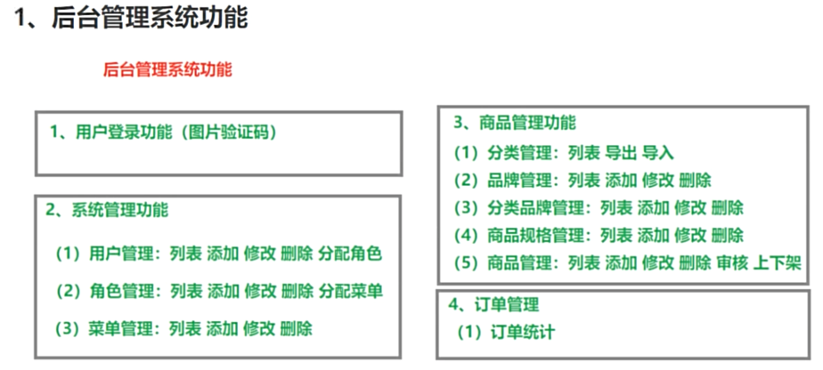
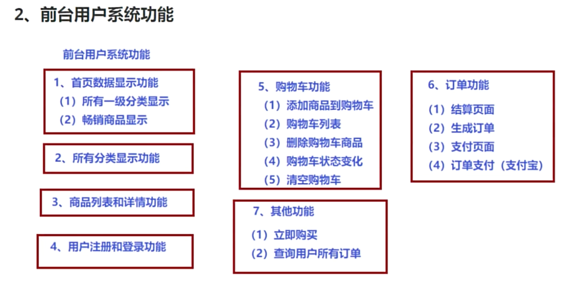
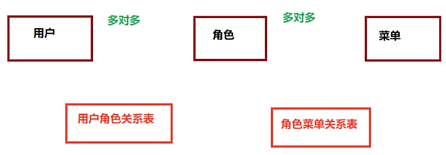
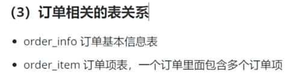

# project-java-spzx
[尚硅谷尚品甄选学习项目](https://www.bilibili.com/video/BV1NF411S7DS)

## Project Features 
- 统一描述
  - 前台：customer portal
  - 后台：admin portal
  - 前端：Frontend
  - 后端：Backend




## Tech Stack

### Tables
- 用户管理

- 商品管理

- 订单管理


### Backend
- Java17
- SpringBoot
- SpringCloud 
  - Nacos, OpenFeign, Gateway, LoadBalance
- MySQL
- Redis:
  - 存储用户信息、验证码
  - Spring Cache
  - 缓存分类信息
  - 使用hash类型存储购物车数据
- Docker
- Git
- Maven
- IDEA
- ThreadLocal
- EasyExcel
- AOP
- MinIO
  - 存储上传的文件
- 定时任务
- 阿里云发送短信
- 

### Frontend
- node16
- Element-Admin: Vue3 + ElementPlus
- ES6: 模版字符串、箭头函数
- Axios
- uni-app

## Setup local environment

- use `docker` install mysql & redis

## Setup commit template
Commit template should be:
```
[devName] #cardNo commitType: message
```

Commit type should be one of the following list:
* feature
* bugfix 
* refactor
* chore
* spike
* document


For example:
```
[san.zhang] #NBD-1 feature: setup codebase
```

