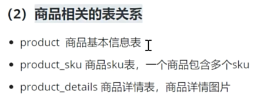

# project-java-spzx
[尚硅谷尚品甄选学习项目](https://www.bilibili.com/video/BV1NF411S7DS)

## Project Features 
- 统一描述
  - 前台：customer portal
  - 后台：admin portal
  - 前端：Frontend
  - 后端：Backend


## Tech Stack

### Tables
- 用户管理

- 商品管理

- 订单管理


### Backend
- Java17
- SpringBoot
- SpringCloud 
  - Nacos, OpenFeign, Gateway, LoadBalance
- MySQL
- Redis:
  - 存储用户信息、验证码
  - Spring Cache
  - 缓存分类信息
  - 使用hash类型存储购物车数据
- Docker
- Git
- Maven
- IDEA
- ThreadLocal
- EasyExcel
- AOP
- MinIO
  - 存储上传的文件
- 定时任务
- 阿里云发送短信
- 

### Frontend
- node16
- Element-Admin: Vue3 + ElementPlus
- ES6: 模版字符串、箭头函数
- Axios
- uni-app

## Setup local environment

- use `docker` install mysql & redis

### Install MySQL
```shell
# 拉取镜像,推荐8的版本
docker pull mysql:8.0.30

# 创建容器
docker run -d --name mysql-spzx -p 3306:3306 -v mysql_data:/var/lib/mysql -v mysql_conf:/etc/mysql --restart=always --privileged=true -e MYSQL_ROOT_PASSWORD=root mysql:8.0.30

# 执行db_spzx.sql脚本
```

### Install Redis
```shell
#1 拉取镜像
docker pull redis:7.0.10

#2 如果/var/lib/docker/volumes没有redis-config，创建数据卷 
docker volume create redis-config

#3 在宿主机的 /var/lib/docker/volumes/redis-config/_data/目录下创建一个redis的配置文件，
vim redis.conf
# 内容如下所示
#开启持久化
appendonly yes
port 6379
# 设置密码，如果需要的话
# requirepass 1234
bind 0.0.0.0

#4 创建容器
docker run -d -p 6379:6379 --restart=always \
-v redis-config:/etc/redis/config \
-v redis-data:/data \
--name redis-spzx redis:7.0.10 \
redis-server /etc/redis/config/redis.conf
```


## Setup commit template
Commit template should be:
```
[devName] #cardNo commitType: message
```

Commit type should be one of the following list:
* feature
* bugfix 
* refactor
* chore
* spike
* document


For example:
```
[san.zhang] #NBD-1 feature: setup codebase
```

